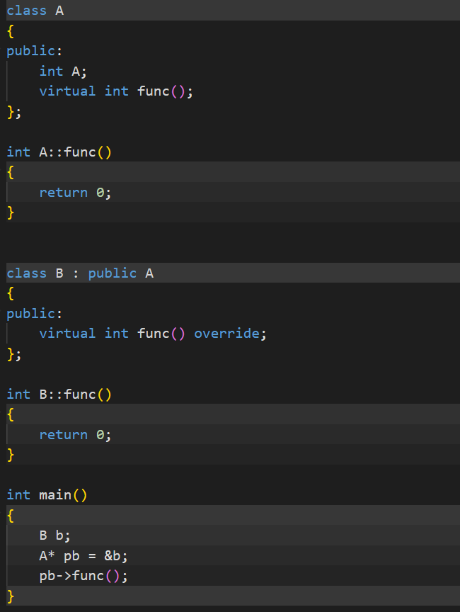
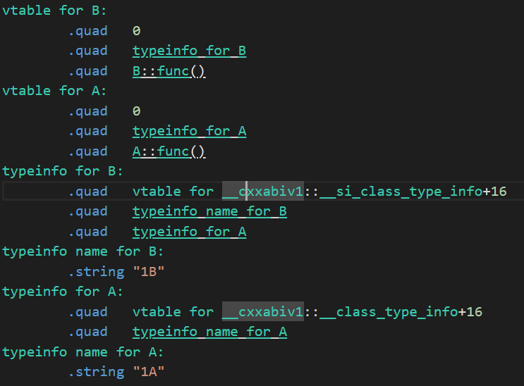
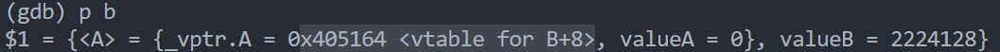
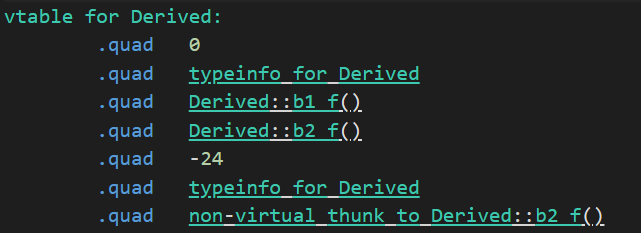
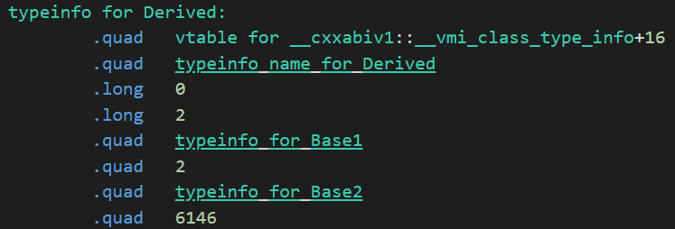

[【精选】c++ vtable 深入解析](https://blog.csdn.net/fcsfcsfcs/article/details/116406860)

1. 虚函数实现机制：

   a. 编译阶段：

   虚函数的实现是通过虚函数表来实现：在程序的.rodata段每一个由虚函数的类都存在一张虚表(继承未重写的也算)，表中包含了各个虚函数的起始地址，类的类型信息(用于RTTI):
   
   
   
   

​	当子类重写父类函数时，其虚表中该函数的地址就会发生变化，否则不变（若子类自己又定义了虚函数，则	在子类的虚表中还会添加这些函数的地址）

​	**为什么每个类用一张虚表？节省空间

​	b. 对象内容

​	在每个对象中，我们知道子类会先(在低地址)存放父类的数据(包括私有成员)，然后再存放自己的数据。但是在存在虚表的情况下，对象会先存放虚函数相关的指向自身虚表(指向表中第一个虚函数)的指针，然后是父类变量，接着才是自己的成员变量：

​	**注：对于父类的私有成员，子类实际上继承了，只是对子类不可见而已，所以子类中会存放父类所有非静态成员



​	**由于虚表指针必然是指向自己的虚表的，所以其包含所有虚函数的入口(包含祖先、父类的继承，以及自身定义的虚函数)所以只需要在对象头定义一虚表指针即可

​	c. 使用虚函数

​	在运行时，首先在变量构造阶段，构造函数将虚表地址放入对象头部。在调用虚函数时，如果使用的是普通对象调用，则链接期会直接把这个函数调用直接转化为对应的函数地址，而如果使用的是指针或引用对象调用，则会通过虚表中函数地址项进行定位：


2. vtable详细解读：

   一个vtable中包含了下面几种信息：

    	1. offset——将父类指针类型的变量转成子类所需要的偏移量（后面再具体说明作用）
    	2. typeinfo地址——包含当前类的类型信息的结构的地址
    	3. 虚函数地址 

   

   而再typeinfo中包含了用于RTTI的信息：

   	1. 指向type_info方法的辅助类虚表的指针 
	
   	（没有父类的基础类继承于`_class_type_info`；基础类指针继承自`__pointer_type_info`；
	
   	单一继承类继承自`__si_class_type_info`；多继承类继承自`__vmi_class_type_info`）
	
   	2. 指向类名的指针
	
   	3. 指向父类typeinfo的指针	

   

3. 构造函数和析构函数可以为虚函数吗？

​	构造函数不可为虚函数，因为在对象未构造之前，对象的虚表指针是不会填写的，也就是说此时对象还无法	通过虚表找到对应的虚函数，如果构造函数为虚函数则无法调用构造函数。

​	对于析构函数在父类存在继承类时必须为虚函数，这样在使用父类指针时，就可以通过虚函数表确定到底是	析构父类还是子类。防止当一个子类对象调用析构函数时。因为非虚情况导致的子类空间未完全释放，造成	内存泄漏和其他资源问题。

​	**注：为什么析构函数名字都不一样但是可以重载？因为每个类只能有一个虚构函数，所以编译器不需要同	名就可以识别这些函数，对其进行重载 。

4. 多继承时虚表结构：

   当子类继承多个父类，并且多个父类具有虚函数时，显而易见子类虚函数表将会分为多个部分

   ```c++
   #include <cstdio>
   #include <typeinfo>
   class Base1
   {
   public:
       int b1_a;
       int b1_b;
       int b1_c;
       virtual int b1_f(){return 0};
   };
   class Base2
   {
   public:
       virtual int b2_f(){return 0};
   };
   class Derived : public Base1, public Base2 
   {
   public:
       virtual int b1_f(){return 0}；
   };
   int main()
   {
       Base2* d = new Derived();
       d->b2_f();
   }
   ```

   我们可以看到：子类和第一个父类共用一个虚表部分，第二个父类再额外使用一个虚表部分

   

   但当Derived类同时重写这些父类的虚函数时，情况有一些区别。

   ```c++
   #include <cstdio>
   #include <typeinfo>
   class Base1
   {
   public:
       int b1_a;
       int b1_b;
       int b1_c;
       virtual int b1_f(){return 0};
   };
   class Base2
   {
   public:
       virtual int b2_f(){return 0};
   };
   class Derived : public Base1, public Base2 
   {
   public:
       virtual int b1_f(){return 0}；
       virtual int b2_f(){return 0};
   };
   int main()
   {
       Base2* d = new Derived();
       d->b2_f();
   
   }
   ```

   如下vtable，因为对`b2_f()`重写的原因，`b2_f`的指针放入了`Derived`和`Base1`共用的虚表部分之中，而在`Base2`的虚表部分增加了指向`non-virtual_thunk_to_Derived::b2_f()`的指针。
   
   

这个函数是用于多态时对类型的识别：


首先，对于Derived的对象，我们查看其内存模型：


当使用`Base2*`指向这个对象时，并调用`b2_f`函数时，`rdi`指向了`_vptr.Base2`，为了使多态成立，这时候`Base2`虚表会跳转到`non-virtual_thunk_to_Derived::b2_f()`，此时再对`rdi`的值减24，这样`rdi`就指向了`_vptr.Base1`这样再通过thunk跳转到Derived的`b2_f`函数。也就是说，通过这样一个变化，进行了父类指针向子类指针的转化

**注：这里-24是因为对应vtable中关于`base2`虚表部分的offset，这个offset是根据`Base1`中的变量计算得到：

8Bvptr + 4Bb1a + 4Bb1b + 4Bb1c + 4Balign = 24B。这样指向子类父类的指针就可以回到子类的头部

5. 虚继承

   虚继承主要解决的时当两个派生类继承同一个父类，且有一子类继承两个派生类，那么对于父类中的数据，子类中就存在两份，在使用这些变量时会导致定义模糊：

   

   所以，我们需要使用虚继承的方式，让两个派生类在继承时：

   ```c++
   class Derived1 : virtual public Base
   class Derived2 : virtual public Base
   ```

   这样最后关于Base类的成员就只有一份。

   原理：

   具体参考开头给的文献，大概就是子类虚表被分为：子类和第一个父类共用部分，其他父类各自部分，以及公共虚基类部分。其他情况同非虚继承相似。

   当然，在子类构造函数中，关于公共基类的构造也不再是通过父类隐式构造，而是先构造基类，再构造父类，最后统一修改关于这些部分的虚表。