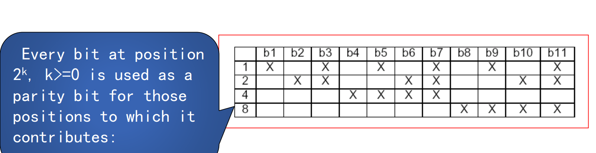

## 数据链路层

### 1. 数据链路层设计问题

1. 为网络层提供的服务：

   i. 无确认的无连接服务：适合于实时应用

   ii. 有确认的无连接服务：相比于无确认更可靠 802.11就是此服务

   iii. 有确认的面向连接服务

2. 成帧方式：对于数据成帧便于后续错误检查

   i. 字节计数法: 帧前加一字段确定帧长

   ii. 字节填充的标志字节法：使用某些特殊字节作为帧开始结束，并使用转移字节辅助

   iii. 比特填充：标志字节更短

   iv. 物理层编码例外法：使用物理层4/5编码时的不合法字节作为标志

   实际网络使用这些方式的组合

3. 错误控制：检查，纠正，反馈错误的信息

4. 流量控制：防止网络中速度慢的一段被大量数据淹没导致传输出错

### 2. 检错与纠错

 1. 纠错：海明码

    海明码的基本思想是在原码中增加额外几位，这几位由原码的一部分进行计算得出。这使得两个不同的码的海明距离增加，也就是说只有原码产生一定位数的错误时才能变为另一个码，这样我们就可以检查是否出错。比如我们增加d+1位，则可以检测出d个错误
    同理，我们也可以纠正错误，纠正d个错误需要增加2d+1位

    具体的校验位的增添位置位1,2,4,8,16,...,计算位数如图：

    

    计算时使用奇偶校验：判断有贡献位（X画）的1的个数和，如为奇数则在相应校验位填1，相反则填0。在检错时则用同样的计算方法判断哪些校验位上的数字出现错误，出现错误的校验位其位置之和即为出错的位。

 2. 检错：循环冗余校验码CRC

    CRC的思想是在原串的后端在加上一段码使得通过双方约定的多项式，接收端可以整除整个串，否则出现错误，具体方式如下：

    首先双方约定生成多项式G(x)，根据生成多项式的x个次幂的系数（0或1）构成一个串。然后，在原串的末尾增加G(x)的最高次幂个数的0，使用这个串除生成串，这里的除操作为XOR。得到一个余数串，将余数串加到原串的末尾，构成带校验码的串传送给接受端。

    * 在信息传递中还有一个***码率***的概念，表示码字中不包含冗余部分所占码字的比率

### 3. 数据链路层协议

 1. 单向传输的协议：先从简单的入手再逐渐复杂

    i. Utopia: 无流量控制和纠错的协议，从网络层拿到数据就传输给物理层

    ii. 单工停等协议：增加了流量控制，需要等待接受端回传一个确认帧

    iii. 带有重传机制的肯定确认协议PAR：又增加了错误检测，发送端增加一个计数器，发送帧后开始计数；在接受端如果接收到了正确的帧，则回传ACK。如果发送端在一定时间内没有收到回传消息则会对该帧进行重新传递。为避免ACK的丢失造成的重复，帧前还要进行标号

 2. 双向传输的协议：单向传输的效率太低，于是我们可以利用双工的信道实现双向的数据传输

    a. 双向传输的提高传输效率的概念：

    ​	i. 捎带确认：需要传输对发送端帧的ACK时，可以将其放在接收端要发送的帧中，这种方式成为***稍待确认***。但是捎带确认引入了ACK需要等待网络层的给出的数据的问题，具体等待时间时需要考虑的

    ​	ii. 滑动窗口：为提高数据传输和实现双向传输的效率，消息发送方需要维护一组序号表示允许它发送的帧，同理接受端也要维护一个队列表示它允许接受的帧。只有落在这些窗口中的帧才允许发送/接受

    b. 具体协议

    ​	i. 1位滑动窗口：PAR的双向实现，需要将接受到的帧的ACK放在要发送的帧中。

    ​	但是，这种协议还是会造成信道带宽的浪费，因为数据的传送再到ACK的返回是一个很长的过程，我们将带宽乘单向的传送时间为***带宽延迟乘积***。实际上，在这段时间内，我们可以在发送端再发送后续的帧来提高利用率。于是将带宽延迟乘积除以一帧的位数（称为BD），我们就能得到在这段时间内我们可以发送多少帧。考虑来回时间和传送完整帧时间，w=2BD + 1则为最大的发送数量。实际不可能达到这么多，但是我们可以允许多个帧同时传输，这种技术称为***管道化***。根据接收端处理管道化出现错误恶的方式，下面可以分出两种协议：

    ​	ii. 退回n协议：该协议接收窗口大小为1，发送窗口大小为n。当发送帧出现错误后，接收端不会接受后续帧，而是等待从错误帧开始的重传，收到后再继续向后接受

    ​	iii. 选择重传协议：该协议接受窗口大小大于1，当发送帧出现错误后，接收端发送一个NAK，然后先将后续发送的帧缓存起来，等到发送端对错误帧重传后再发送一个缓存的最大的帧数的ACK（累计确认）。这种方式要求发送方的每一个发送帧都需要一个计时器以免将未接受的帧过早覆盖，同时发送方的窗口大小选择也要注意不能使得相邻两个窗口位置的帧序号出现重叠。

### 4. 具体例子

广域网的基础设施多使用点到点的链路。而PPP点到点协议多被用于这些线路上。

1. SONET数据包
2. ADSL
3. DOCSIS

