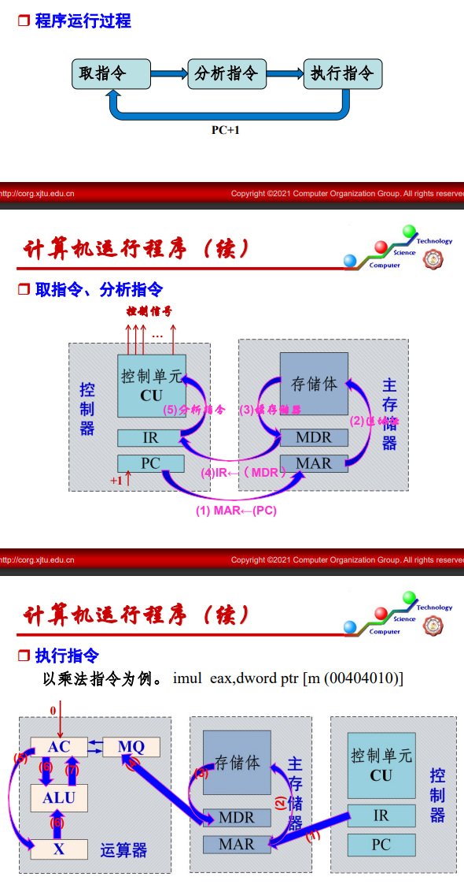

## 计算机系统概论

### 1. 系统组成

计算机系统 = 硬件 + 软件

* 系统如何运行一个c语言程序（可以作为一个总览看看，具体csapp）

  1. 转换程序：将源程序编译为机器指令

     首先***编译***将高级语言转化为汇编语言，在***汇编***把汇编语言转化为机器指令，随后通过***链接***将每个单独程序汇成一完整程序，并对代码绑定地址

     其中链接分为静态动态，静态在生成可执行文件前，动态在程序加载时和运行时才进行、

  2. 运行程序

     系统通过***加载器***将程序加载到内存，加载器完成程序的定位。然后系统就可以通过执行指令了。 同链接，加载也分为动态和静态两种，在程序load进内存时对程序每个段的定位为静态；而在运行时对某些变量的定位为动态

### 2. 计算机的硬件组成

主要部件：I/O设备，存储器，控制器，运算器

特点:

1. 指令数据均用二进制表示，且无区分放在存储器中
1. 指令由操作数和操作码构成，在存储器中按顺序存放

部件介绍：

1. I/O设备：
   通过IO子系统完成交互，其包含IO设备和IO接口。设备通过IO接口与主机相连

2. 主存储器

   主存包括存储体，以及访存相关寄存器（MDR，MAR）控制电路。其中存储体由大量存储单元组成，每个单元又包含多个存储1bit数据的存储元。

   例：在读取数据时，控制器将地址发至MAR，控制电路将相应地址的数据放入MDR，后续在传送给其他部件完成一次读取

3. 控制器

   控制器包含PC程序计数器，IR指令寄存器，CU控制单元。PC用于存放下一条指令的地址，其与MAR相连，用于取指令。IR存放正在运行的指令，其与MDR相连。CU用于分析指令，并给其他部件发送控制信号

4. 运算器

   运算器包括ALU，及其用于运算的寄存器（ACC，MQ，X）和其他通用寄存器

   具体运行过程：

### 3. 