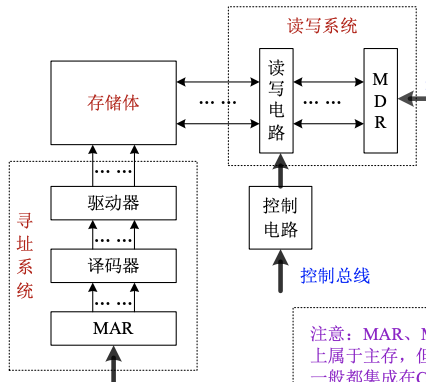
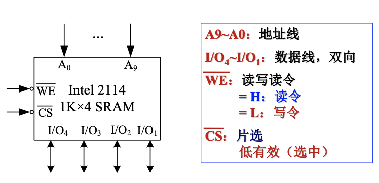
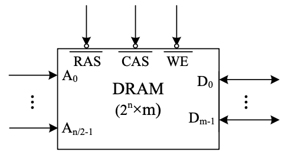
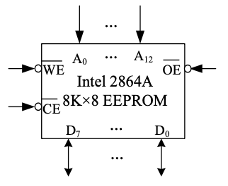
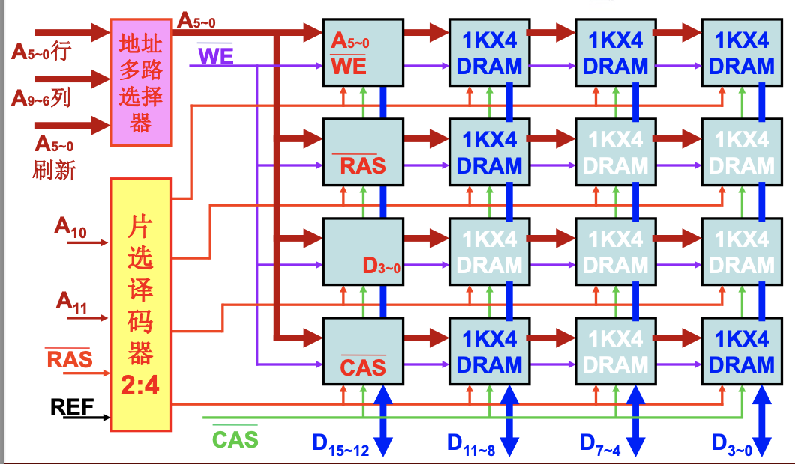

## 存储器

### 1. 存储器分类（主要以存取方式）*

1. 具体分类

   i. RAM随机存储器：任意存储单元数据可随机读写操作，需持续加电。一般作为cache和内存。分为：SRAM（快，小，不用刷新），DRAM（慢，大，要刷新），NVRAM（用于掉电时保护数据）

   ii. ROM只读存储器：一般只读不写，非电易失的。一般用于bios存放系统程序或驱动

   iii. SAM顺序存取存储器：只能顺序查找。如磁带

   iv. DAM直接存取存储器：先随机寻址小区域，在小区域内顺序查找。如磁盘

   v. CAM相连存储器：按存储内容查找。用于快速检索

2. 存储系统结构

   由于各种存储元件的速度，容量，造价各有优势，现代计算机使用一种层级存储来达到速度，容量，价格的平衡。具体为：Register$\leftarrow$Cache$\leftarrow$Memory$\leftarrow$辅助存储器

   设计时应遵循：包含性原则—内层数据是外层的副本；一致性原则—不同层次间信息一致

### 2. 主存储器

1. 基本构成：存储体（由众多独立编址的存储单元构成）；寻址系统（包括MAR，译码器和驱动器—放大信号）；IO系统（包括MDR，读写电路）；控制电路

   如下图:
   
   
   
   对于寻址系统，一般有线选法和重合法两种：
   
   线选法将所有地址线送到一个译码器中，这样设计结构简单但需要的线路多
   
   重合法将地址线分为行地址和列地址，减少所需的器件用量(一般来说DRAM采用这种寻址系统，且行和列使用同一组引脚，由RAS行选信号和CAS列选信号控制)		

2. 性能指标

   i. 容量：字编址—存储元个数X存储字长(b)；字节编址—字节数(B)

   ii. 存取速度：存取时间MAT—一次读写操作的时间；MCT存取周期—两次存取操作的最小时间间隔

   iii. 带宽：每次存取的字/字节数*存取周期的倒数；即单位时间存取信息量

3. SRAM

   由6个晶体管构成的锁存器

   外特性符号：

   *对于任意的逻辑符号，要在方框内标明型号容量和引端名；在方框外标明引脚线和信号名

4. DRAM

   由单晶体管和电容构成（需电容漏电要定期充电刷新）

   i. DRAM的再生：读取操作对于DRAM来说会放点，所以需要将读出的内容写回，称为***再生***

   ii. DRAM的刷新：

   ​	集中式刷新：在最大刷新时间间隔内，集中安排一段时间对每一行刷新

   ​	分散式刷新：在每次读写操作后，对一行进行刷新

   ​	异步式刷新：在最大刷新时间间隔内，将每一行的刷新分散在其内。需要额外计数器控制，但高效

   iii. 外特性符号：

   

   iv. 新型dram：FPM DRAM；EDO DRAM；SDRAM；DDR SDRAM

5. ROM

   类型：MROM一次直接写入；PROM一次写入，可自编程；EROM可多次写入；EEPROM电可擦除；Flash闪存

   外特性符号：

   

6. 存储器容量拓展以及与CPU连接

   i. 容量拓展：

   ​	a. 位拓展：多片存储的输出并成更多位的输出。需要将存储器的地址线，片选使能，读写控制分别并连起来；总字数=片数*单片字数

   ​	b. 字拓展：多片存储连接在一起扩充存储器字数，通过译码器多选1。需要将存储器的数据线和读写控制并连起来，同时地址线的低位送引脚，高位送译码器接各芯片的片选使能；总容量=片数*单片容量

   ​	c. 字位拓展：两种混用

   如图：

   

*注：该图为DRAM的容量扩展示意图。相比于SRAM和ROM，他多了用于异步刷新的刷新地址和相应的定时信号

​	ii. 存储器与CPU连接：

​		SRAM和ROM：CPU地址线地位连芯片高位连译码器；CPU数据线与存储器直接连接；CPU IO控制与芯片WE相连（ROM不用连）；CPU访存请求MREQ与译码器使能端相连

​		DRAM：通过DRAMC与CPU相连，包括：刷新地址计数器；地址多路选择器；刷新定时器；仲裁电路；地市发生器