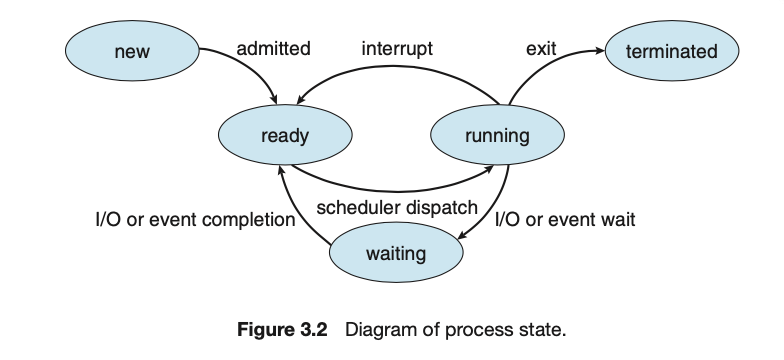

## 进程

### 1. 进程的相关概念

1. 进程程序区别：

   进程是一种活动的实体，具有其运行状态，内存印象，寄存器相关状态等

   程序是一种静态的实体，是一种包含了大量指令的可执行文件

2. 进程状态

   进程在运行时会由于CPU对其的调度而发生状态的转变。抽象来说，一个程旭可以有以下五种状态：New，Ready，Running，Waiting，Terminated，其转换图如下：

   

3. 进程在OS中的表示PCB

   操作系统管理进程所需的数据都在PCB中：为使进程可以在调度中保存和恢复，操作系统使用一种进程控制块PCB保存所有先关信息，包括：进程描述信息；寄存器状态；CPU调度信息（进程优先级等有关调度队列的信息）；内存管理信息（页表，堆栈，段头信心等）；IO状态（打开文件，IO服务等）；计数信息

### 2. 进程调度

为更好利用CPU，使用户能同时处理多种应用，操作系统需要一种进程调度的机制，该机制主要包含三个部分：调度队列；调度程序；具体调度方式（上下文切换）

1. 调度队列：分为就绪队列和各种类型的等待队列。就绪队列等待分配CPU时间；等待队列为进程执行中遇到某些需要触发的事件后进入的队列，事件完成后会加入就绪队列。

   *注：在老版本中进程admit后会放在job queue中（磁盘），然后再由长期调度程序将其加载进内存，进入ready queue。

2. CPU调度程序：选择就绪队列中的进程分配CPU资源，调度周期短

   在一些系统中还有一些中间的调度，其将进程换入或换出内存来保证内存的容量

   *注：老版本中还有长期调度程序

3. 上下文切换：具体的CPU调度方式为context switch：对于当前进程状态保存，并对下一进程的状态恢复（通过PCB）

**在进程调度时到底发生了什么：

	1. 通过中断使CPU由用户态切换到内核态
	2. 将用户态栈指针rsp压入内核栈，rsp指向内核栈底 （）
	3. 将CPU状态保存至内核栈
	4. 进行context switch，操作系统将当前rsp, 页表指针，进程打开文件列表等信息保存当前进程的PCB
	5. 将另外进程的这些信息从他的PCB取出，设置进程相关资源
	6. 通过rsp和他的内核栈恢复CPU状态，并将rsp指向用户栈
	7. CPU由内核态切换到用户态

### 3. 进程的使用

1. 进程创建：申请空PCB，分配进程资源，将PCB加入ready list

   操作系统通过pid标识进程。创建子进程时，子进程地址空间可以是父进程的复制，也可以运行新的程序。同时，父进程也可以要么等待子进程结束要么与其同时执行

2. 进程终止：

   一些OS要求父进程终止子进程全部也终止，这种称为cascade termination

   此外还有OS可以允许子进程独立存在。子进程在终止后操作系统会回收资源，但是并不会完全删除PCB保留。这是因为子进程通常包含了相应的返回状态，如果完全删除则父进程要查看执行情况时就会出问题。所以只有当父进程执行`wait()`后子进程才会完全删除。我们把已经终止但没有完全删除的进程叫zombie process而当父进程终止且无调用wait时，这种进程为orphan process。init进程将成为其父进程，并调用wait

3. 进程阻塞/唤醒：找到要阻塞进程PCB，设置为阻塞态，并将该PCB放入event/IO设备的waiting list；唤醒时则将PCB放入ready list并设置就绪态

4. 调度过程则见2

   为保证进程控制的完整性，这些操作都需要原语实现，即过程中要关闭中断，直到完成

### 4. 进程通讯

进程间通讯分为共享内存和消息传递两种，共享内存由于不需要切换内核态完成相应操作所以更快

1. 共享内存

   特征：数据和位置有由进程自己决定；

   ​			进程间自己确保不会出现同时写入的问题

2. 消息传递

   消息传递使用Send，Revieve原语

   i. 种类：直接/间接

   ​	直接需要显示的指出消息的发出/接受者

   ​	间接通过邮箱或端口收发消息

   ii. 同步：对于消息传递原语的实现可以是同步（阻塞）或异步的（非阻塞）

   iii. 缓冲：发出的消息需要存储在一个临时的队列中

   ​	a. Zero capacity：发出者必须阻塞send确保消息不会被覆盖
   ​	b. bounded capacity
   ​	c. unbounded capacity

3. IPC系统样例

   i. POSIX共享内存

   ii. Windows ALPC

   iii. Linux Pipe

   ​	分为普通管道和命令管道两种：普通管道需要通讯双方为父子且管道单工，需要提供输入和输出管道；命名管道为双工管道，用于多方通讯且无需父子关系，管道不会因进程的终止而消失

4. CS系统通讯

   i. Socket

   ​	进程间通过一组socket进行通讯。socket由ip和port唯一指定。当然socket是一种底层的通讯方式，仅支持字节传输

   ii. RPC

   ​	相比于Socket，RPC更high-level。它允许client通过RPC远程执行进程：client端将message和port通过kernel发送给监听相应端口的deamon，然后deamon使server执行进程并将结果返回client的kernel，kernel在传回client