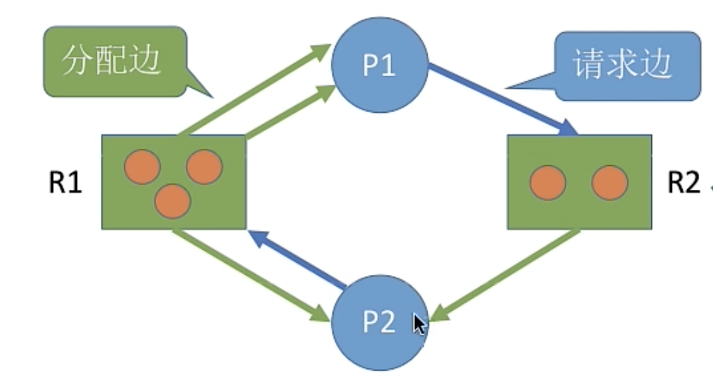

1. 死锁概念：

   各进程持有资源并请求其他进程持有的资源，导致所有进程都阻塞

   原因：系统资源不足，进程获得资源顺序不合适

2. 死锁必要条件：

   i. 互斥：使用临界资源

   ii. 非抢占：资源只能进程主动释放

   iii. 占有并等待：保持某些资源并请求其他资源 

   iv. 循环等待：存在资源的循环等待链

3. 死锁处理策略：

   死锁预防；死锁避免；死锁检测和解除

4. 死锁预防：破坏必要条件

   a. 将临界资源改造为共享资源(Spooling假脱机)

   b. 抢占资源：当申请资源无法满足就释放拥有的资源；操作系统协助抢夺其他进程的资源

   c. 持有并等待：进程运行前分配所有需要的资源

   d. 循环等待：给资源排序，要求进程按递增顺序申请资源

5. 死锁避免：银行家算法——尝试分配后是否为安全序列

   安全序列：当系统按此序列分配资源时每个进程都能完成

   安全状态：存在安全序列的状态就是安全状态，否为非安全状态

   银行家算法：

   ​	a. 检查申请是否超过最大需求

   ​	b. 检查申请是否超过可用资源

   ​	c. 尝试分配资源，修改各个状态

   ​	d. 使用安全性算法(找安全序列)检测是否进入非安全状态，则退回分配 

6. 死锁检测和解除

   资源分配图：

​	检测算法：消除不阻塞进程所有相连边，最后剩下的多个进程为死锁进程

​	解除算法：

​		a. 进程终止：终止所有死锁进程，或一次终止一个进程知道死锁解除

​		b. 资源抢占：回滚进程到安全状态，或剥夺一个进程的所有资源